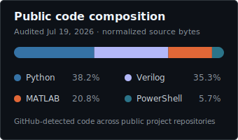

# Hi, I'm Amit Thusay

**Electrical engineering student designing PCBs, embedded systems, FPGA/DSP pipelines, and analog hardware.**

[Portfolio](https://amitthusay-personal-site.vercel.app/) &middot; [LinkedIn](https://www.linkedin.com/in/amit-thusay-577209203/) &middot; [Email](mailto:amt272@case.edu)

I'm an electrical engineering undergraduate at Case Western Reserve University. I design systems from architecture and simulation through PCB layout, firmware, FPGA implementation, and verification, with experience spanning research and engineering contracts.

## Engineering stack

Tools I use to move hardware from an idea to an implemented and verified system.

**PCB and simulation**

**FPGA and DSP**

**Embedded and automation**

---

## Project highlights

<table>
  <tr>
    <td width="50%" valign="top">
      <h3>Steerable ultrasonic nerve stimulator</h3>
      
Designed the four-layer Rev3 hardware after independently verifying all eight GaN half-bridge/RLC output channels near 1.36 MHz, building on earlier real-time array control.

      

        
        
        
      

      <a href="https://amitthusay-personal-site.vercel.app/projects/suns/">Case study &rarr;</a>
      &nbsp;&middot;&nbsp;
      <a href="https://github.com/amitthusay/ultrasonic-nerve-stimulator">Repository &rarr;</a>
    </td>
    <td width="50%" valign="top">
      <h3>Fixed-point FPGA FIR filter</h3>
      
Built a 21-tap, 16-bit fixed-point 50 kHz low-pass filter workflow from MATLAB and HDL Coder to synthesizable Verilog, Vivado simulation, and post-simulation checks.

      

        
        
        
      

      <a href="https://amitthusay-personal-site.vercel.app/projects/fpga_fir_filter/">Case study &rarr;</a>
      &nbsp;&middot;&nbsp;
      <a href="https://github.com/amitthusay/fpga-fir-filter">Repository &rarr;</a>
    </td>
  </tr>
  <tr>
    <td width="50%" valign="top">
      <h3>OpsiClear multi-camera trigger controller</h3>
      
Designed the system architecture, schematic, and two-layer Rev F PCB. Its ESP32-S3 trigger path, level translation, and buffered BNC outputs were simulation-backed and demonstrated with the camera array.

      

        
        
        
      

      <a href="https://amitthusay-personal-site.vercel.app/projects/buffer_amplifier/">Case study &rarr;</a>
      &nbsp;&middot;&nbsp;
      <a href="https://github.com/amitthusay/multi-camera-trigger-controller">Repository &rarr;</a>
    </td>
    <td width="50%" valign="top">
      <h3>Haptic-enabled adapted toys</h3>
      
Built and presented an ESP32 haptic prototype to ReplayForKids, then designed a custom driver and signal-conditioning PCB and button enclosure for switch-adapted toys.

      

        
        
        
      

      <a href="https://amitthusay-personal-site.vercel.app/projects/haptic_adapted_toys/">Case study &rarr;</a>
      &nbsp;&middot;&nbsp;
      <a href="https://github.com/amitthusay/haptic-switch-adapted-toys">Repository &rarr;</a>
    </td>
  </tr>
</table>

---

## GitHub stats

<table>
  <tr>
    <td align="center" valign="middle">
      
    </td>
    <td align="center" valign="middle">
      
    </td>
  </tr>
</table>

Language composition audited July 19, 2026 from GitHub-detected source bytes across the public project repositories. It does not represent KiCad, LTspice, images, or other hardware-design assets.
